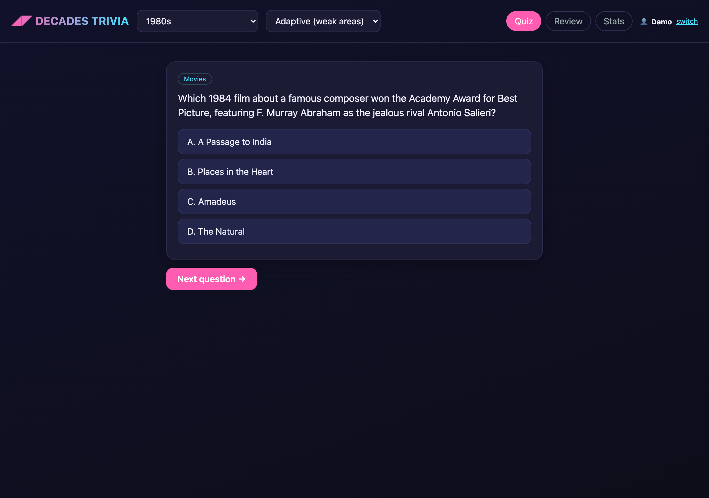

# Decades Trivia

A trivia study app for a decades-themed trivia night. Pick a decade
(60s/70s/80s/90s/00s), **All decades**, or **🗓 This Week in History**
(June 14–20), get quizzed across pop-culture categories, track hits/misses, and
review facts. Questions are **generated from Claude's knowledge of each decade**
(broad coverage) and **fact-checked by a two-model consensus** so you don't
study hallucinations.

Built fully AWS-native: **Bedrock** (Claude Sonnet 4.5 + Opus 4.5 for generation
and verification, Titan for embeddings), **Lambda + API Gateway + DynamoDB**,
**S3** for the corpus, ACM/Cloudflare custom domain. No external API keys.

**Live:** https://trivia.megillini.dev



## How a question is made

1. **Generate** (`backend/shared/quiz.py`) — Claude writes a pub-style
   multiple-choice question about a notable subject in the selected era.
2. **Fact-check (the important part)** — the marked answer is hidden and **two
   different models (Sonnet 4.5 + Opus 4.5) independently answer the question
   blind**. It's kept only if both pick the marked answer. This catches wrong
   answers *and* ambiguous questions; anything in doubt is discarded.
3. **Quality guards** — reject questions that reveal/telegraph their own answer;
   enforce the June 14–20 window for This Week; randomize answer position.
4. **Bank** (`backend/shared/bank.py`) — verified questions are stored in
   DynamoDB (the "database") keyed by subject for dedup, and served instantly;
   live generation only fills gaps. Per-user served-history prevents repeats.

## RAG (used for the review-facts feature)

A Wikipedia corpus (`ingestion/ingest.py` → Titan embeddings) powers semantic
**fact review** with citations (`/api/facts`) — retrieval + grounded recall,
separate from the knowledge-based quiz path.

## Categories

Music, Movies, Television, Sports, News & Politics, Pop Culture, Toys & Games,
Science & Tech, Fashion, **Rowing** (rowing-group trivia night), and
**This Week in History**.

## Build the question bank

```bash
python3 -m venv venv && ./venv/bin/pip install boto3 numpy
./deploy.sh                                              # SAM stack + upload corpus
AWS_PROFILE=watchtower AWS_REGION=us-east-2 ./venv/bin/python ingestion/gen_bank.py
```

`gen_bank.py` seeds the verified question bank per decade × category (re-run to
top up; slices already at target are skipped). `study.py` is an offline terminal
quiz for local practice.

## Deploy

```bash
CERT_ARN=<acm-arn> DOMAIN=trivia.megillini.dev ./deploy.sh
```

## License

MIT — see [LICENSE](LICENSE).
